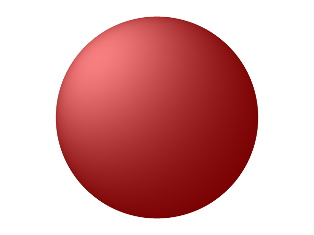

# raytracer
Simple raytracing experiment with golang: 
- math stuff done using vector algebra
- anti-aliasing is done in SSAA/FSAA-style
- uses only standard libraries

Program produces image like this:



## running
```
$ go run *.go
```
Produces image file ```out.png``` in the current directory.
